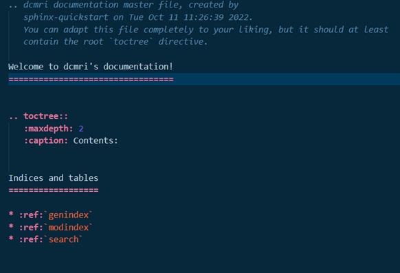
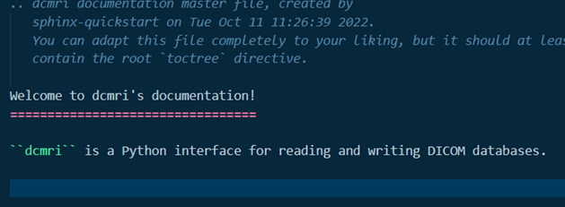

index.rst file
===============

In addition to the ``conf.py`` file, an ``index.rst`` file is also created in
the ``docs/source/`` directory after running the ``sphinx-quickstart`` command. This
file is a restructured text file and contains everything that will be displayed
on the project's index or 'welcome' page.

For a brief guide on formatting rst files, see
:ref:`Working with restructured text files`, or for a more in-depth guide, see
`here <https://docutils.sourceforge.io/docs/ref/rst/directives.html>`_. 

Some common options for customising this file are shown below.

Customising text content
----------------------------

Open the ``index.rst`` file and take a look at it's structure. It should look
a little something like this:

Edit the top of the file (underneath the **'Welcome to dcmri's documentation!'**
heading) as desired. This text will be displayed on the welcome page of the
website.

*Directives*
++++++++++++

Special features may be added to an rst file using
`directives <https://www.sphinx-doc.org/en/master/usage/restructuredtext/basics.html#rst-directives>`_.
Directives are generic blocks of explicit markup and are used for inserting
objects such as a table of contents, figures, warning/note boxes, quotes,
tables, etc., onto the html page.

A directive should always begin with a blank line seperating it from the
section above. The name of the directive is always written between ``..``
and ``::``, (i.e., ``.. name_of_directive::``). Specific features of a directive
are indicated on an indented line directly below the directive heading inside
colons, i.e., ``:feature:`` Another blank line then separates the directive
heading/features from its contents.

*Warning box example*
#########################

The following code snippet demonstrates how to include a ``!warning`` box on
``dcmri``'s welcome page using the ``warning`` directive. The directive name
is on the top line, while the custom text is below, separated by a blank line.

.. code-block:: rst

   .. warning::
      
      ``dcmri`` is developed in public, however it is a work in progress.
      Therefore, please bear in mind some features are still in development and
      **backwards compatibility is not likely to happen**.

After running ``Sphinx``'s ``make html`` command again, the updated html should
look a little something like this:

.. figure:: /images/index-page_warning.png

Creating a table of contents (i.e., toctree)
----------------------------------------------

Of course, the welcome page isn't the only thing we want to see... We're going
to need some *contents* for populating the rest of the documentation. A default,
empty contents has already been generated from the ``sphinx-quickstart`` command -
this is the ``.. toctree::`` directive. Some features for this directive have
already been specified underneath.

* ``:maxdepth:`` indicates the number of nested headings to display.

* ``:caption:`` is used to specify the title for the contents (this is set by default
to ``Contents``, however can be changed to anything):
 
.. code-block:: rst
   
   .. toctree::
      :maxdepth: 2
      :caption: My contents are better than your contents:

It is also possible to hide the contents on the welcome page so that it is only
shown in the html sidebar by including the feature ``:hidden:`` on an indented
line directly below the directive name:

.. code-block:: rst
   
   .. toctree::
      :hidden:
      :maxdepth: 2
      :caption: My contents are better than your contents:

But wait a minute..... where are the actual *contents* of the contents?

For this, we're going to need to make some more pages to link to. These will be
similar to the current ``index.rst`` file, however containing the new content that
should be displayed for those pages.

Begin by copying and pasting this ``index.rst`` file within the ``docs/source/``
directory. Rename the file and open it to edit the contents.

.. figure:: /images/index-page_newpage1.png

.. figure:: /images/index-page_newpage2.png

Delete the text and directives and give page a new header, along with some custom
text:

.. figure:: /images/index-page_newpage3.png

Then save the file. This new html page is now ready to be included on the welcome
page's table of contents. Do this by returning to the ``index.rst`` file, and
add the file name (excluding suffix) to the ``.. toctree::`` directive.

.. code-block:: rst
   
   .. toctree::
      :maxdepth: 2
      :caption: My contents are better than your contents:

      mynewsection

Save all files and run the ``make html`` command once again (note: this must be
repeated after any change is made to the documentation). We now have a new page
which is listed in our contents!

.. figure:: /images/index-page_newpage4.png

.. figure:: /images/index-page_newpage5.png
